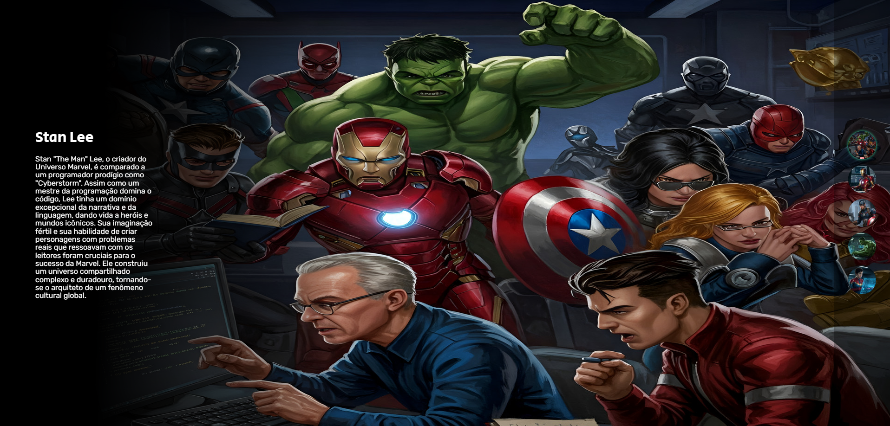

🚀 Semana do Zero ao Programador Contratado - Projeto Interativo Marvel

🧠 Sobre o Projeto
Este é um projeto interativo e responsivo criado como parte da Semana do Zero ao Programador Contratado.
A proposta é misturar aprendizado de desenvolvimento web com uma pitada de criatividade nerd, usando personagens icônicos para representar perfis profissionais e analogias com o mundo da programação! 💻✨

🔥 Tema: Marvel x Programação
Cada herói representa um arquétipo de programador ou papel em uma equipe de desenvolvimento, como:
Stan Lee – O Arquiteto das ideias 💡
Homem de Ferro – O Engenheiro Fullstack 🔧
Capitão América – O Gerente de Projetos 🧭
Hulk – A Força Bruta do Computador ⚡
Capitã Marvel – A Energia Cósmica dos Devs 🚀

🛠️ Tecnologias Utilizadas
HTML5
CSS3
JavaScript
Google Fonts
Design Responsivo (Mobile First)

🎯 Funcionalidades
✅ Interface interativa com troca de personagem ao clicar nos botões
✅ Animações suaves entre seleções
✅ Layout adaptável para diferentes dispositivos (responsivo)
✅ Descrições criativas associando heróis à programação

💡 Inspiração
Este projeto foi inspirado pela ideia de transformar o aprendizado técnico em algo divertido, memorável e visualmente envolvente.
A união entre super-heróis e desenvolvimento torna o estudo mais empolgante e simbólico! 💥

🦸‍♀️ Créditos
Desenvolvido com dedicação por Silvia Avelar durante a Semana Dev.
Imagens usadas apenas para fins educacionais

📸 Prévia

